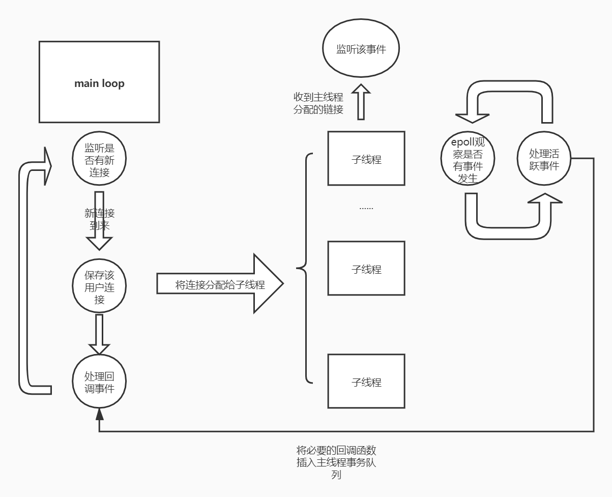

### Webserver
学习中写的一个简陋http服务器，支持get方法。

#### Reactor模型
one loop per thread + thread pool. 通过epoll实现多路复用。以有限状态机解析url

#### 开发环境
* 操作系统：CentOS 7
* 编译器：gcc 7.3
* 版本管理：git
* 文本编辑器:： vim
* 测试工具：WebBench

#### 实现思路及经历
初始版本为在学习linux高性能服务器编程时练习所写，采用了one loop + thread pool的异步模型。
在学习了linuxc++多线程服务端编程以及Muduo源码后，将IO模型改成了one loop per thread + thread pool的形式。并将原来的线程池模板改成了非模板实现。

主线程使用std::shared_ptr保存用户连接，子线程使用std::weak_ptr访问用户连接，只有在分配连接时涉及到锁的争夺，在一定程度上避免了锁的争用。

主线程以round_robin方式分配连接，在将用户分配给子进程时，通过eventfd唤醒可能阻塞在epoll的子线程使其立刻处理新到来的连接。

参照Muduo的思路以及RAII思想封装了pthread_mutex_t对象。

通过设置定时器来处理超时连接。

最近重做了压测，大概在webbench连接数量达到28500的时候服务器达到极限，在执行完一次60s28500连接后服务器后台产生了大量处于close-wait状态的未中断连接，这里推测是服务器主线程回调队列出了问题，导致无法删除完成连接。内存仍剩余大量空闲，cpu满载，99%的时间处于内核系统调用状态，strace跟踪进程后显示其中90%的时间是锁的争用。这应该就是目前这个版本的性能极限了，等我再取些经回来进行性能优化。

#### 计划
* 性能优化
* 添加定时器处理超时连接（已完成）
* 添加异步日志
* 代码结构优化
