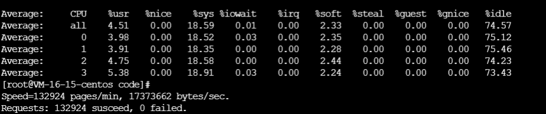
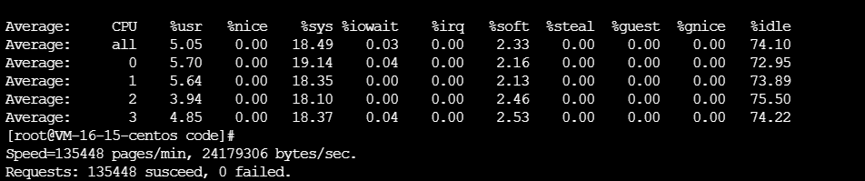
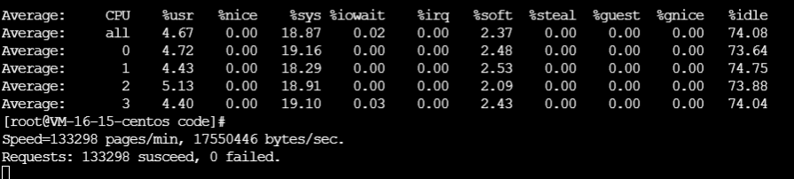
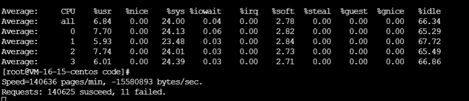
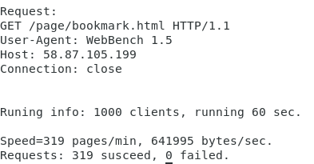
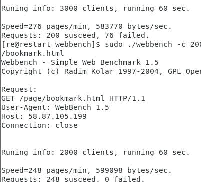

### 性能测试及分析

#### 服务器配置
腾讯云主机
CentOS 7.8 64位 4核cpu 内存16GB 带宽5Mb
标准型S3

#### 压测工具
webbench 设置连接时间60s，连接数量位10000 和20000.
mpstat 监控cpu状态

#### 压力测试
##### 本机连接
由云主机自己运行webbench访问本机端口。
1. 10000连接  3线程

2. 10000连接 4线程

3. 10000连接 8线程

4. 20000连接 4线程

##### 远程连接
由个人vmware虚拟机访问远程服务器端口
选择4线程
1. 1000连接

2. 2000连接 & 3000连接

#### 性能分析
由于云主机配置的是4核，可以看到程序运行在4线程时的pages/min明显大于8线程和3线程。这里猜测是因为既充分利用了处理器且省去了线程切换的消耗。

另外在连接数量达到20000时，可以看到已经开始出现了些许failed requests。远程连接受网络带宽影响，在连接数量达到2000以上时开始出现错误。
